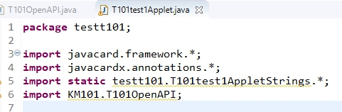
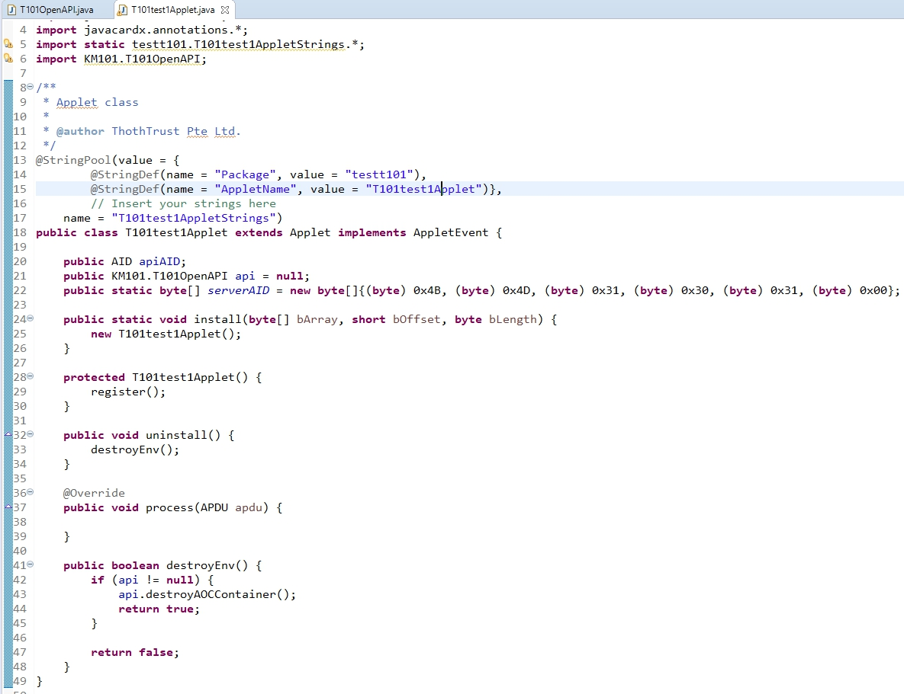

# Creating Your First Applet #

* Please ensure you have followed the steps to setup your card before creating an applet by following the instructions [here](https://github.com/ThothTrustCom/T101-Devhub/blob/master/Setting-Up-Your-T101.md).

## Setting up your JavaCard Developer Kit environment ##

1. Download the latest Oracle JCDK from [here](https://www.oracle.com/java/technologies/javacard-sdk-downloads.html).
2. Unzip or extract the JCDK to a folder or install it to a location of your choice.
3. Alternatively, you may want to install [JCIDE](https://www.javacardos.com/tools) that already has the Oracle JCDK packaged with it to skip the installation steps and have a fully functioning Java Card IDE right out of the box.
4. Clone the repository or download the `KM101.exp` file from the repository. You will need this export file to use the THETAKey T101 functions.
5. Open the JCDK directory which you have setup previously and look for the `api_export_files` folder.
6. Create the directories `\KM101\javacard\` and copy the `KM101.exp` file into the newly created directory.

	

## Setting Up Your First Applet Project ##

1. Open your preferred Java capable IDE (i.e Eclipse or JCIDE). If you are using JCIDE, there is nothing much you need to do. For Eclipse, please follow the instructions [here](https://docs.oracle.com/javacard/3.0.5/guide/eclipse-java-card-plug.htm#JCUGC126) to install the JCDK plugin for Eclipse IDE.

2. Create a Java Card Classic project. For Eclipse users, create a new Project:

	a. 

	b. 

	c. 

	For JCIDE users, simply click on `File > New > Project` in a straightforward manner. Fill in the necessary project details and in the `Where` section, select from dropdown box the option to `Create a new solution ....`.

3. After setting up a project, create a package in your source code called `KM101` where you will copy in the `T101OpenAPI.java` Sharaeble Interface java file into the `KM101` package and call from it the T101 methods.

	For Eclipse Users, the screenshots of the steps are as follows:
	
	a. 

	b. 

4. Begin importing the `T101OpenAPI` into your applet source code

	

5. Add implementation of `AppletEvent` to your `Applet` and create an `uninstall()` method as shown in the screenshot below. The `uninstall()` method should trigger a `api.destroyAOCContainer()` call when the applet uninstallation process begins to ensure that the Key Manager environment is kept clean and tidy.

	

6. You will need to now get an API instance using the following code while referencing the T101Test1 sample codes found [here](https://github.com/ThothTrustCom/T101-Devhub/tree/master/Samples/T101Test1):

		if (api == null) {
			try {
				apiAID = JCSystem.lookupAID(serverAID, (short) 0, (byte) serverAID.length);
			} catch (Exception e) {
				ISOException.throwIt(ISO7816.SW_FILE_NOT_FOUND);
			}
			if (apiAID != null) {
				api = (T101OpenAPI) JCSystem.getAppletShareableInterfaceObject(apiAID, (byte) 0);
				if (api == null) {
					ISOException.throwIt(ISO7816.SW_APPLET_SELECT_FAILED);
				}
			} else {
				ISOException.throwIt(ISO7816.SW_CONDITIONS_NOT_SATISFIED);
			}
		}

7. Other steps like using a hard-coded `serverAID` with the value of `(byte) 0x4B, (byte) 0x4D, (byte) 0x31, (byte) 0x30, (byte) 0x31, (byte) 0x00` as shown in the `T101Test1` sample code are required. The `T101Test1` sample codes uses the `CLA=B0` and `INS=00` for setting up the API instance while the `INS=01` is used to initialize and create an AOC container, populate the AOC container with an administrative user account, set the AOC container's authentication PIN code and the administrative user's PIN code while also setting the publicly known Application Name for the AOC Container and the Applet. An expiry timestamp is also set as part of the container's security parameters. More information would be discussed in later topics regarding the usage of the expiry timestamp on containers, credentials and Key Manager objects.

## Compiling and Loading Your Project ##

Eclipse would automatically compile and package your project while JCIDE would require the user to press `F7` hotkey to compile and package the project.

We will assume that the `T101Test1` project is used and each individual IDE would compile the project and generate a `CAP` file which is the JavaCard's version of an installation file. Your IDE would provide you with the location to look for the `CAP` file which you would then use to install it into your T101 card.

Assuming that the user is using the [GlobalPlatformPro](https://github.com/martinpaljak/GlobalPlatformPro/releases) toolkit, you would typically download the `gp.jar` or `gp.exe` and then go to your Terminal or Command Line and enter the following command to load your T101 card with the CAP file (you must have the card reader inserted into the USB port of your computer and the card inserted into your card reader).

If you have download the Java JAR version of the GP toolkit, you will need to append the `java -jar` command before the `gp` and change the `gp` in the commands below to `gp.jar` instead.

	> gp -jar -install "<location-of-CAP-file>"

You will get a `CAP Loaded` response indicating that you have successfully loaded the CAP file into the card. If you receive any other messages, you might want to enable verbose debug via:

	> gp -jar -install "<location-of-CAP-file>" --verbose --debug

You will have an entire verbose debug log of all the commands and responses between the T101 card when attempting to install the CAP file onto the T101 card.

If you have the CAP file already installed before and you are seeking to reinstall the card, you must delete the old applet from the card (this will cause all the data including PIN codes and security keys stored in the applet to be destroyed) before updating a new CAP file.

List and search for your Applet and its AID:

	> gp -jar -l

Delete the applet:

	> gp -jar -delete <Your-Applet-AID>

Note that you must NEVER DELETE the following CAP files otherwise it may prevent the card from operating normally.

* A000000003000000 (ISD applet AID)
* A0000001515350 (Manufacturer applet AID)
* D00000000002 (Manufacturer applet AID)
* 544D43524F4F5401 (Manufacturer applet AID)
* 4B4D313031 (KM101 applet AID)
* 4B4D314755 (GOC Container Management applet AID)

You will now have the applet (T101Test1) installed inside your T101.

	> java -jar gp.jar -l
	Warning: no keys given, using default test key 404142434445464748494A4B4C4D4E4F
	ISD: A000000003000000 (OP_READY)
    	 Privs:   SecurityDomain, CardLock, CardTerminate, CardReset, CVMManagement, TrustedPath, AuthorizedManagement, TokenVerification, GlobalDelete, GlobalLock, GlobalRegistry, FinalApplication, ReceiptGeneration

	APP: 544D43524F4F5401 (SELECTABLE)
    	 Privs:

	APP: 4B4D31303100 (SELECTABLE)
    	 Privs:

	APP: 4B4D31475500 (SELECTABLE)
    	 Privs:

	APP: 5555555555FF (SELECTABLE)
    	 Privs:

	PKG: A0000001515350 (LOADED)
    	 Applet:  A000000151535041

	PKG: D00000000002 (LOADED)

	PKG: 4B4D313031 (LOADED)
    	 Applet:  4B4D31303100

	PKG: 4B4D314755 (LOADED)
    	 Applet:  4B4D31475500

	PKG: 5555555555 (LOADED)   <---- T101Test1 Applet
    	 Applet:  5555555555FF

To select the T101Test1 applet, use the following APDU command with an APDU command tool (i.e. [pyAPDUTool](https://www.javacardos.com/tools#pyApduTool)).

1. Select Applet:

	`CLA=00 INS=A4 P1=04 P2=00 LC=05 5555555555 LE=00`

	Expected Reply: `9000`

2. Initialize Applet's API instance:
	
	`CLA=B0 INS=00 P1=00 P2=00 LC=00 LE=00`

	Expected Reply: `9000`

3. Create AOC container, administrator and display a 'Setup Complete' message when successful.

	`CLA=B0 INS=01 P1=00 P2=00 LC=1E  030A06030000000031313168656C6C6F776F726C6461646D696E31313233 LE=00`

	Expected Reply: `9000`

	Note that the screen of the card will flash a 'Setup Complete' message. You will need to press either the OK or C button to close the window and allow proceed of returning the status word to the card reader.

	

## Front Panel Accessing of T101Test1 AOC Container ##

Now you will be able to access limited management functionalities of the T101Test1 AOC Container from the so-called 'Front Panel' which is the technical term for accessing the card directly from the embedded screen and keypad.

1. You will have to remove the card from the reader before you boot up the card to the Front Panel mode.

2. Firmly press the power button until the card boots up

3. Select the `helloworld` option (the name we gave to the AOC container for the T101Test1 applet. Use the upwards and downwards button to scroll the cursor up or down and press the 'OK' button to select. Press the 'C' button as the backwards button to exit the current menus or sub-menus.

	

4. Select 'admin1' administrative user

	

5. Enter PIN code '123' using the '0' or downwards to increment the virtual keypad cursor and the '5' or upwards button to jump across button groups. The backwards facing arrow is for single backspace action and the 'X' is to cancel the current operation and the tick symbol is to submit the operation. Please take your own to scroll through as the E-Ink screen requires time to render the cursor jump.

	

6. Select 'Delete' option to look for any existing non-administrative users to delete from the AOC container.

	

7. No users (non-administrative users) should be available for deletion from the Front Panel mode.

	

These are the basic steps for setting up and creating the first applet for the T101 card with additinoal actions to display messages on the E-Ink screen !

