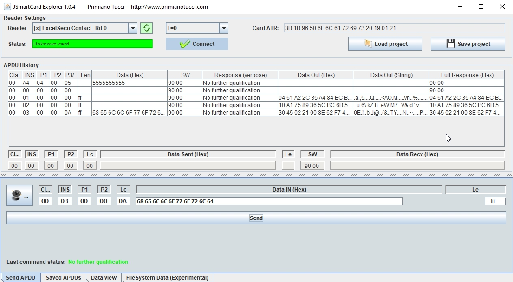

# BrainPool 256 Bits Sample Code

### Installation
CAP file can be found in the 'deliverables' folder.

### Build
Project is an Eclipse IDE project and can be imported into your Eclipse IDE.

Please ensure JavaCard plugin for Eclipse IDE has been installed on your IDE.

### Test Case
Test table can be found in the 'test' folder with the full APDUs and responses.

